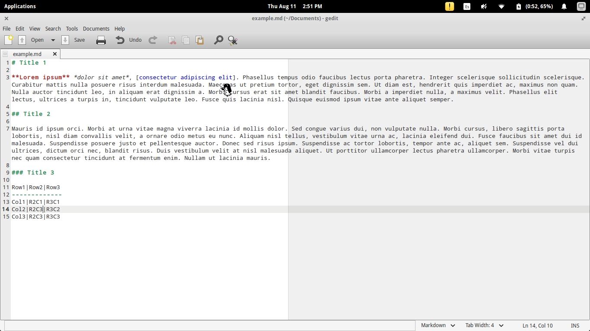

# 427008.github.io
***
#### Fourth-level heading
> ## Blockquoted header
>
> This is blockquoted text.
>
> This is a second paragraph within the blockquoted text.

This is *emphasized* _text_.  
This is very heavily **emphasized** __text__.

  
+ One
+ Two
+ Three
    - Nested One
    - Nested Two

<figure>

    <figcaption>A single track trail outside of Albuquerque, New Mexico.</figcaption>
</figure>

> :grin: **Tip:** Remember to appreciate the little things in life.
